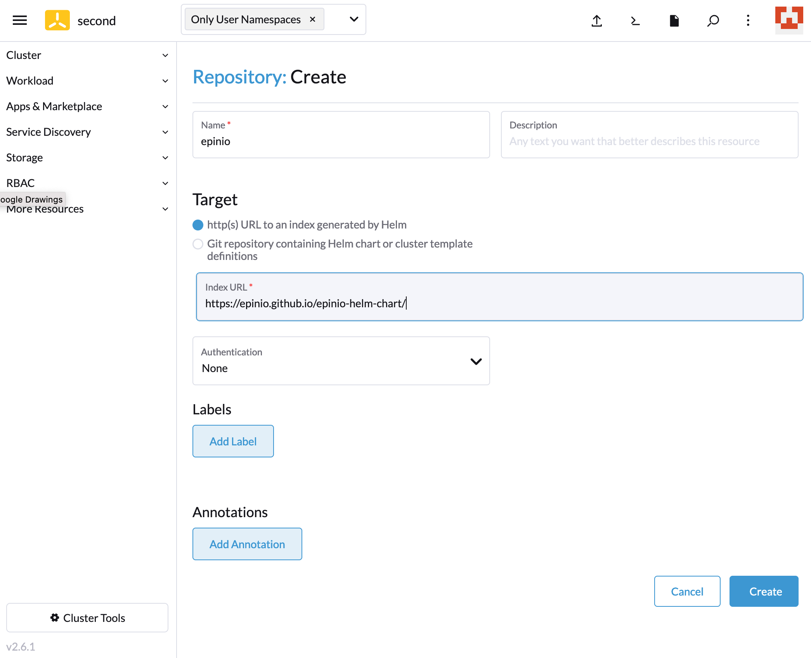
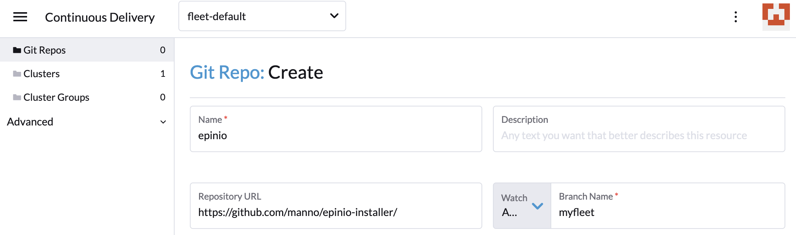

-------------------------------------

Epinio is meant to take you from App to URL in one step. It does that by either applying buildpacks to your app, or using a pre-built docker image.

Epinio comes with a pretty sophisticated installer, that knows how to install the Epinio API server in Kubernetes and setup all the dependencies.



[Installing with the CLI installer](https://docs.epinio.io/installation/installation.html), can be as easy as running `epinio install`.

## Helm Chart

What's new is that we packaged that installer into a Helm chart. That chart supports the same arguments as the Epinio installer. It's useful for integrating Epinio in existing workflows.


The Helm chart can be [installed directly as described in the documentation](https://docs.epinio.io/installation/install_epinio_with_helm.html#usage).

You will have to download a matching [Epinio CLI](https://github.com/epinio/epinio/releases).
Make sure to run `epinio config update`, after the installation, to get the Epinio API credentials for the CLI.

Note: Just like the Epinio installer, the chart does not support upgrades, yet. Also, uninstallation will delete all pushed apps.

## Rancher Marketplace

The chart's repository can be added to Rancher's marketplace. This needs to be done for each cluster separately.



You can then install the Epinio chart from the "Apps & Marketplace/Charts" menu.

Note: Epinio lacks support for the UI provided by Rancher's Helm wrapper. So the installation will likely fail, because you cannot set the system domain (yet). We're working on it.

## Rancher Continuous Delivery

Installing Epinio via Fleet makes it possible to install on multiple clusters, as well as applying configuration, like the system domain. If installing to multiple clusters, each installation will have a separate API servers, with separate credentials.

To deploy Epinio via Fleet, one needs to create a Github repository for ones clusters, like this [example fleet repo](https://github.com/manno/epinio-installer/blob/myfleet/fleet.yaml).

The `fleet.yaml` manifest lists the Epinio release to install and provides settings for Helm's `values.yaml`.

```yaml
helm:
  releaseName: epinio

  chart: "epinio"
  repo: "https://epinio.github.io/epinio-helm-chart"
  version: "0.1.12"

  values:
    domain: "myfleet.example.suse.dev"
```

Now we can add the Git repository to Rancher's Continuous Delivery:



Rancher will monitor the repository and update the installation, if the manifest changes.

Note: It's not quite GitOps yet, as updates to the installation will fail until the Epinio installer is idempotent.
